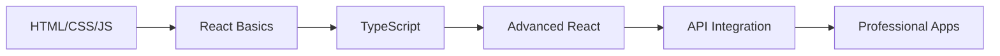

<div align="center">

# 🚀 Elevvo Software Development Portfolio

**Professional Web Development Projects & Modern Frontend Solutions**

[](https://elevvo-tasks.vercel.app/)
[](https://github.com/khaledrokaya/Elevvo-tasks)
[](LICENSE)
[](https://www.linkedin.com/in/khaled-mostafa-jr)

*A comprehensive showcase of progressive web development skills through real-world projects*

[**🌐 Live Portfolio**](https://elevvo-tasks.vercel.app/) • [**📱 Mobile Demo**](https://khaledrokaya.github.io/Elevvo-tasks/) • [**💼 Developer Profile**](https://www.khaled-mostafa.me/)

</div>

---

## 📊 Project Overview

This repository represents a **complete software development journey** showcasing expertise in modern web technologies. Built during my professional internship at **Elevvo**, each project demonstrates progressive skill development from foundational web technologies to advanced React applications with real-world functionality.

### 🎯 **Core Achievements**
- ✅ **8 Production-Ready Projects** with live deployments
- ✅ **Modern Tech Stack Mastery** (React, TypeScript, TailwindCSS)
- ✅ **Professional Development Practices** (Git workflows, code reviews, documentation)
- ✅ **Mobile-First Responsive Design** across all projects
- ✅ **Real-World API Integration** with external services
- ✅ **Performance Optimization** and accessibility compliance

---

## 🏆 Featured Projects

<table>
<tr>
<td width="50%">

### 🌦️ **Weather Dashboard**
**Advanced React + TypeScript Application**

- **Real-time weather data** with geolocation
- **3-day forecast** with professional UI
- **Glass morphism design** effects
- **Mobile-responsive** architecture

[**🔗 Live Demo**](https://khaledrokaya.github.io/Elevvo-tasks/Tasks/Level3.7/) | [**📝 Code**](https://github.com/khaledrokaya/Elevvo-tasks/tree/main/Tasks/Level3.7)

</td>
<td width="50%">

### 📊 **Professional Dashboard**
**Data Visualization & Interactive Charts**

- **Interactive chart libraries** integration
- **TypeScript** type safety
- **Responsive data layouts**
- **Professional UI/UX** design

[**🔗 Live Demo**](https://khaledrokaya.github.io/Elevvo-tasks/Tasks/Level3.6/) | [**📝 Code**](https://github.com/khaledrokaya/Elevvo-tasks/tree/main/Tasks/Level3.6)

</td>
</tr>
<tr>
<td width="50%">

### 📝 **Personal Blog Platform**
**Modern React Blog with Advanced Features**

- **Dynamic filtering & pagination**
- **Real-time search functionality**
- **TailwindCSS 4** integration
- **Font Awesome** icons system

[**🔗 Live Demo**](https://khaledrokaya.github.io/Elevvo-tasks/Tasks/Level2.4/) | [**📝 Code**](https://github.com/khaledrokaya/Elevvo-tasks/tree/main/Tasks/Level2.4)

</td>
<td width="50%">

### 🎯 **TaskFlow Landing Page**
**Modern SaaS Marketing Website**

- **Component-based architecture**
- **Scroll animations** & effects
- **Pricing sections** & testimonials
- **Conversion-optimized** design

[**🔗 Live Demo**](https://khaledrokaya.github.io/Elevvo-tasks/app/) | [**📝 Code**](https://github.com/khaledrokaya/Elevvo-tasks/tree/main/Tasks/Level2.3)

</td>
</tr>
</table>

---

## 🛠️ Technical Excellence

### **Frontend Technologies**
```
Languages      → HTML5, CSS3, JavaScript ES6+, TypeScript, JSX
Frameworks     → React 18+, Vite
Styling        → TailwindCSS 4, CSS Grid, Flexbox, Font Awesome
APIs           → REST APIs, WeatherAPI, Geolocation API
Tools          → Git, GitHub, npm, Chrome DevTools
Deployment     → Vercel, GitHub Pages
```

### **Professional Skills Demonstrated**

<div align="center">

| **Category** | **Technologies & Concepts** |
|:---:|:---|
| 🎨 **UI/UX Design** | Responsive Design, Mobile-First, Glass Morphism, Accessibility (WCAG) |
| ⚛️ **React Mastery** | Hooks, State Management, Component Architecture, Lifecycle Methods |
| 🔧 **Advanced JavaScript** | ES6+ Features, Async/Await, DOM Manipulation, Event Handling |
| 🎯 **TypeScript** | Type Safety, Interfaces, Advanced Typing, Error Prevention |
| 🌐 **API Integration** | RESTful APIs, Error Handling, Loading States, Real-time Data |
| 📱 **Performance** | Code Splitting, Lazy Loading, Optimized Assets, SEO |

</div>

---

## 📁 Complete Project Collection

<details>
<summary><b>🔍 View All Projects (Click to Expand)</b></summary>

### **🚀 Advanced Level Projects**

#### **Level 3.7 - Weather Dashboard** 
*Real-time weather application with professional UI*
- **Stack**: React 18+ • TypeScript • WeatherAPI • TailwindCSS
- **Features**: Geolocation, 3-day forecast, glass morphism, mobile-responsive
- [**Live Demo**](https://khaledrokaya.github.io/Elevvo-tasks/Tasks/Level3.7/) • [**Source Code**](https://github.com/khaledrokaya/Elevvo-tasks/tree/main/Tasks/Level3.7)

#### **Level 3.6 - Professional Dashboard** 
*Data visualization dashboard with interactive charts*
- **Stack**: React 18+ • TypeScript • Chart Libraries • TailwindCSS
- **Features**: Interactive charts, responsive layout, professional UI design
- [**Live Demo**](https://khaledrokaya.github.io/Elevvo-tasks/Tasks/Level3.6/) • [**Source Code**](https://github.com/khaledrokaya/Elevvo-tasks/tree/main/Tasks/Level3.6)

### **💻 Intermediate Level Projects**

#### **Level 2.5 - Interactive School Website** 
*Multi-page educational website with image galleries*
- **Stack**: HTML5 • CSS3 • JavaScript ES6+
- **Features**: Interactive galleries, responsive design, smooth animations
- [**Live Demo**](https://khaledrokaya.github.io/Elevvo-tasks/Tasks/Level2.5/) • [**Source Code**](https://github.com/khaledrokaya/Elevvo-tasks/tree/main/Tasks/Level2.5)

#### **Level 2.4 - Personal Blog Platform** 
*Modern blog with dynamic filtering and pagination*
- **Stack**: React 18+ • TailwindCSS 4 • Font Awesome • Vite
- **Features**: Category filtering, real-time search, pagination, responsive grid
- [**Live Demo**](https://khaledrokaya.github.io/Elevvo-tasks/Tasks/Level2.4/) • [**Source Code**](https://github.com/khaledrokaya/Elevvo-tasks/tree/main/Tasks/Level2.4)

#### **Level 2.3 - TaskFlow Landing Page** 
*Modern task management application landing page*
- **Stack**: React 18+ • TailwindCSS • Vite
- **Features**: Component architecture, scroll animations, pricing sections
- [**Live Demo**](https://khaledrokaya.github.io/Elevvo-tasks/app/) • [**Source Code**](https://github.com/khaledrokaya/Elevvo-tasks/tree/main/Tasks/Level2.3)

### **🎯 Foundation Level Projects**

#### **Level 1.2 - Advanced Contact Form** 
*Dynamic contact form with real-time validation*
- **Stack**: HTML5 • CSS3 • JavaScript ES6+
- **Features**: Form validation, error handling, responsive design
- [**Live Demo**](https://khaledrokaya.github.io/Elevvo-tasks/Tasks/Level1.2/) • [**Source Code**](https://github.com/khaledrokaya/Elevvo-tasks/tree/main/Tasks/Level1.2)

#### **Level 1.1 - Interactive Sidebar Navigation** 
*Responsive collapsible sidebar with smooth animations*
- **Stack**: HTML5 • CSS3 • Vanilla JavaScript
- **Features**: Mobile responsiveness, accessibility features, smooth transitions
- [**Live Demo**](https://khaledrokaya.github.io/Elevvo-tasks/Tasks/Level1.1/) • [**Source Code**](https://github.com/khaledrokaya/Elevvo-tasks/tree/main/Tasks/Level1.1)

</details>

---

## 🚀 Quick Start

### **Prerequisites**
- Node.js 18+
- npm 8+
- Modern web browser

### **Installation & Setup**

```bash
# Clone the repository
git clone https://github.com/khaledrokaya/Elevvo-tasks.git
cd Elevvo-tasks

# For React applications (Level 2.3, 2.4, 3.6, 3.7)
cd Tasks/[ProjectFolder]
npm install
npm run dev

# For static projects (Level 1.1, 1.2, 2.5)
# Simply open index.html in your browser
```

### **Development Commands**
```bash
npm run dev      # Start development server
npm run build    # Build for production
npm run preview  # Preview production build
```

---

## 📈 Development Journey

### **🎯 Learning Progression**



| **Phase** | **Technologies** | **Key Learnings** |
|:---:|:---|:---|
| **Foundation** | HTML5, CSS3, JavaScript | DOM manipulation, responsive design, accessibility |
| **Modern Development** | React, TailwindCSS, Vite | Component architecture, state management, build tools |
| **Advanced Skills** | TypeScript, APIs, Charts | Type safety, data integration, visualization |
| **Professional** | Git, Deployment, Performance | Version control, CI/CD, optimization |

---

## 🏗️ Project Architecture

```
Elevvo-tasks/
├── 📱 app/                    # Main React application hub
├── 🎯 Tasks/                  # Individual project implementations
│   ├── Level1.1/             # Interactive sidebar navigation
│   ├── Level1.2/             # Advanced contact form
│   ├── Level2.3/             # TaskFlow landing page
│   ├── Level2.4/             # Personal blog platform
│   ├── Level2.5/             # Interactive school website
│   ├── Level3.6/             # Professional dashboard
│   └── Level3.7/             # Weather dashboard
├── 📄 docs/                  # Documentation and guides
├── 🔧 .github/               # GitHub workflows and templates
└── 📋 README.md              # Project overview (this file)
```

---

## 🌟 Professional Highlights

### **🎨 Design Excellence**
- **Mobile-First Design**: All projects optimized for mobile devices
- **Accessibility Compliance**: WCAG 2.1 AA standards across projects
- **Modern UI Patterns**: Glass morphism, card layouts, responsive grids
- **Performance Optimized**: Fast loading times and smooth animations

### **💻 Technical Proficiency**
- **Clean Code Practices**: Consistent formatting, meaningful naming, documentation
- **Version Control**: Git workflows with meaningful commit messages
- **Testing & QA**: Cross-browser compatibility, responsive testing
- **Deployment**: Production-ready builds with CI/CD pipelines

### **🚀 Innovation & Creativity**
- **Problem Solving**: Creative solutions to complex UI/UX challenges
- **User Experience**: Intuitive interfaces with excellent usability
- **Modern Frameworks**: Latest React patterns and TypeScript integration
- **API Integration**: Real-world data integration with error handling

---

## 🎖️ Certifications & Recognition

<div align="center">

[](https://elevvo.com/)
[](https://reactjs.org/)
[](https://www.typescriptlang.org/)

</div>

---

## 👨‍💻 Developer Profile

<div align="center">

### **Khaled Mostafa**
*Frontend Developer & Software Engineering Student*

[](https://www.khaled-mostafa.me/)
[](https://www.linkedin.com/in/khaled-mostafa-jr)
[](mailto:khaled.mustafa.jr@gmail.com)
[](https://github.com/khaledrokaya)

**📍 Location**: Tanta, Gharbia, Egypt  
**📱 Phone**: +20 1121370379

</div>

### **🎯 Professional Focus**
- **Frontend Development**: React, TypeScript, Modern CSS
- **UI/UX Design**: User-centered design principles
- **Performance Optimization**: Web vitals and accessibility
- **Open Source**: Contributing to developer community

---

## 🤝 Contributing & Collaboration

### **How to Contribute**
1. **Fork** this repository
2. **Create** a feature branch (`git checkout -b feature/amazing-feature`)
3. **Commit** your changes (`git commit -m 'Add amazing feature'`)
4. **Push** to the branch (`git push origin feature/amazing-feature`)
5. **Open** a Pull Request

### **Code Standards**
- Follow existing code style and conventions
- Write meaningful commit messages
- Include documentation for new features
- Test across multiple browsers and devices

---

## 📄 License & Usage

This project is licensed under the **MIT License** - see the [LICENSE](LICENSE) file for details.

### **Educational Use**
- ✅ Free to use for learning and educational purposes
- ✅ Code examples can be referenced for similar projects
- ✅ Attribution appreciated but not required

---

## 📞 Contact & Support

<div align="center">

### **Let's Connect!**

For **collaboration opportunities**, **technical questions**, or **project inquiries**:

[](mailto:khaled.mustafa.jr@gmail.com)
[](https://www.linkedin.com/in/khaled-mostafa-jr)
[](https://www.khaled-mostafa.me/)

**Response time**: Usually within 24 hours

</div>

---

<div align="center">

## 🌟 **Built with passion for web development and commitment to excellence** 🌟

*This portfolio represents continuous learning and growth in software development*

### **⭐ If you found this helpful, please star the repository!**

[](https://github.com/khaledrokaya/Elevvo-tasks)

**[⬆ Back to Top](#-elevvo-software-development-portfolio)**

---

*Last updated: October 2025 • Made with ❤️ by [Khaled Mostafa](https://www.khaled-mostafa.me/)*

</div>